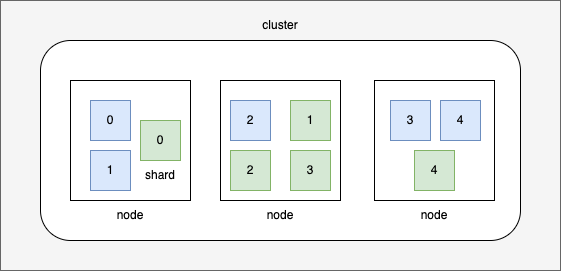

# 2. Document
index 내부에 document가 존재한다. 검색하는 데이터의 가장 작은 단위다. 
SQL과 비교했을때 index가 데이터베이스라면 document는 raw에 해당한다.
document는 id로 구별한다. id는 `string`, `integer`등의 타입을 가질 수 있다.

```json
{
    "_index": "user",
    "_type": "_doc",
    "_id": "1",
    "_score": 1,
    "_source": {
        "username": "halin.lee"
    }
}
```

중첩구조를 가질 수 있다.
```json
{
    "_index": "user",
    "_type": "_doc",
    "_id": "1",
    "_score": 1,
    "_source": {
        "username": "halin.lee",
        "info": {
            "company": "dunamu"
        }
    }
}
```

배열을 포함할 수 있다.
```json
{
    "_index": "user",
    "_type": "_doc",
    "_id": "1",
    "_score": 1,
    "_source": {
        "username": "halin.lee",
        "languages": ["java", "c++", "kotlin"]
    }
}
```

## node&shard


샤드는 엘라스틱 서치가 노드에서 노드로 옮기는 가장 작은 단위다.
노드는 엘라스틱서치의 인스턴스다. 샤드는 최소 하나의 복제를 가지고 있으면, 
어느 노드가 사라져도 엘라스틱서치는 여전히 모든 데이터를 제공할 것이다.
